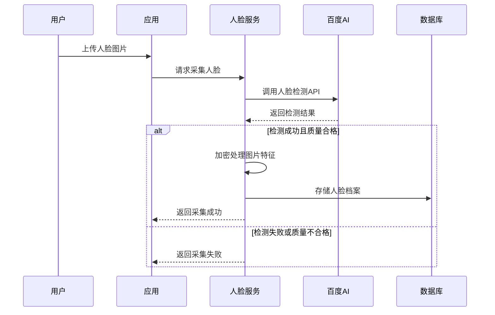
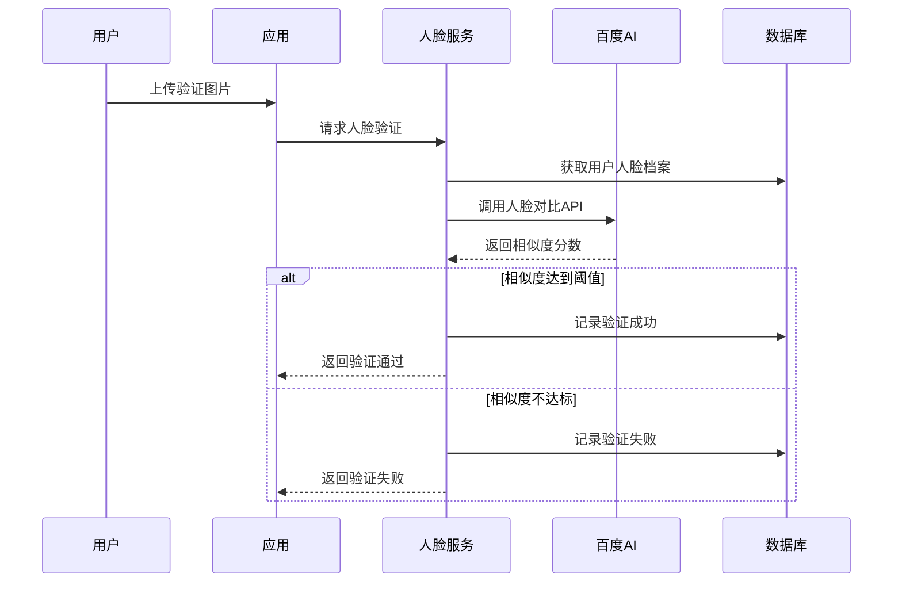

# 百度AI人脸识别接口集成方案

## 接口概述

### 使用的百度AI接口

1. **人脸检测接口** - `/rest/2.0/face/v3/detect`
   - 用途：人脸采集时的质量评估和特征提取
   - 功能：检测图片中的人脸，返回人脸位置、质量分数等信息

2. **人脸对比接口** - `/rest/2.0/face/v3/match`
   - 用途：人脸验证时的身份确认
   - 功能：比较两张人脸图片的相似度

3. **人脸搜索接口** - `/rest/2.0/face/v3/search` (可选)
   - 用途：在人脸库中搜索相似人脸
   - 功能：支持大规模人脸库的快速搜索

## 技术架构设计

### 核心组件

```
BaiduAiClient (百度AI客户端)
├── AuthenticationService (认证服务)
├── FaceDetectionService (人脸检测服务)
├── FaceComparisonService (人脸对比服务)
└── FaceSearchService (人脸搜索服务)

ConfigurationManager (配置管理器)
├── ApiCredentials (API凭证)
├── RateLimiter (频率限制器)
└── CacheManager (缓存管理器)
```

### 数据流程

#### 人脸采集流程



#### 人脸验证流程



## API接口详细说明

### 1. 人脸检测接口

#### 请求参数

```json
{
    "image": "base64编码的图片数据",
    "image_type": "BASE64",
    "face_field": "age,beauty,expression,face_shape,gender,glasses,landmark,landmark150,quality,eye_status,emotion,face_type,mask,spoofing"
}
```

#### 响应数据

```json
{
    "error_code": 0,
    "error_msg": "SUCCESS",
    "log_id": 1234567890,
    "timestamp": 1617000000,
    "cached": 0,
    "result": {
        "face_num": 1,
        "face_list": [
            {
                "face_token": "face_token_string",
                "location": {
                    "left": 100,
                    "top": 100,
                    "width": 200,
                    "height": 200,
                    "rotation": 0
                },
                "face_probability": 0.99,
                "quality": {
                    "occlusion": {
                        "left_eye": 0,
                        "right_eye": 0,
                        "nose": 0,
                        "mouth": 0,
                        "left_cheek": 0,
                        "right_cheek": 0,
                        "chin_contour": 0
                    },
                    "blur": 0.1,
                    "illumination": 80,
                    "completeness": 1
                }
            }
        ]
    }
}
```

### 2. 人脸对比接口

#### 请求参数

```json
[
    {
        "image": "base64编码的图片1",
        "image_type": "BASE64",
        "face_type": "LIVE",
        "quality_control": "LOW",
        "liveness_control": "NONE"
    },
    {
        "image": "base64编码的图片2",
        "image_type": "BASE64",
        "face_type": "IDCARD",
        "quality_control": "LOW",
        "liveness_control": "NONE"
    }
]
```

#### 响应数据

```json
{
    "error_code": 0,
    "error_msg": "SUCCESS",
    "log_id": 1234567890,
    "timestamp": 1617000000,
    "cached": 0,
    "result": {
        "score": 85.123456,
        "face_list": [
            {
                "face_token": "face_token_1"
            },
            {
                "face_token": "face_token_2"
            }
        ]
    }
}
```

## 配置管理

### 配置文件结构

```yaml
# config/packages/face_detect.yaml
face_detect:
  baidu_ai:
    # 主要配置
    app_id: '%env(BAIDU_AI_APP_ID)%'
    api_key: '%env(BAIDU_AI_API_KEY)%'
    secret_key: '%env(BAIDU_AI_SECRET_KEY)%'
    
    # 备用配置（可选）
    backup:
      app_id: '%env(BAIDU_AI_BACKUP_APP_ID)%'
      api_key: '%env(BAIDU_AI_BACKUP_API_KEY)%'
      secret_key: '%env(BAIDU_AI_BACKUP_SECRET_KEY)%'
    
    # API配置
    endpoints:
      base_url: 'https://aip.baidubce.com'
      auth_url: '/oauth/2.0/token'
      detect_url: '/rest/2.0/face/v3/detect'
      match_url: '/rest/2.0/face/v3/match'
      search_url: '/rest/2.0/face/v3/search'
    
    # 质量控制
    quality:
      min_face_size: 80          # 最小人脸尺寸
      max_blur: 0.3              # 最大模糊度
      min_illumination: 40       # 最小光照度
      min_completeness: 0.8      # 最小完整度
      min_confidence: 0.8        # 最小置信度
    
    # 对比阈值
    comparison:
      success_threshold: 80.0    # 验证成功阈值
      warning_threshold: 70.0    # 警告阈值
      
    # 频率限制
    rate_limit:
      requests_per_second: 10    # 每秒请求数
      requests_per_day: 50000    # 每日请求数
      
    # 缓存配置
    cache:
      enabled: true
      ttl: 3600                  # 缓存时间（秒）
      
    # 重试配置
    retry:
      max_attempts: 3            # 最大重试次数
      delay: 1000               # 重试延迟（毫秒）
      
    # 超时配置
    timeout:
      connect: 5                 # 连接超时（秒）
      read: 30                   # 读取超时（秒）
```

### 环境变量配置

```bash
# .env
BAIDU_AI_APP_ID=your_app_id
BAIDU_AI_API_KEY=your_api_key
BAIDU_AI_SECRET_KEY=your_secret_key

# 备用配置（可选）
BAIDU_AI_BACKUP_APP_ID=backup_app_id
BAIDU_AI_BACKUP_API_KEY=backup_api_key
BAIDU_AI_BACKUP_SECRET_KEY=backup_secret_key
```

## 错误处理

### 错误码映射

```php
const BAIDU_ERROR_MAPPING = [
    // 认证相关
    110 => 'INVALID_ACCESS_TOKEN',
    111 => 'ACCESS_TOKEN_EXPIRED',
    
    // 参数相关
    216015 => 'INVALID_IMAGE_FORMAT',
    216016 => 'IMAGE_SIZE_TOO_LARGE',
    216017 => 'IMAGE_SIZE_TOO_SMALL',
    
    // 人脸相关
    222001 => 'NO_FACE_DETECTED',
    222002 => 'MULTIPLE_FACES_DETECTED',
    222003 => 'FACE_TOO_SMALL',
    222004 => 'FACE_TOO_BLURRY',
    222005 => 'FACE_INCOMPLETE',
    
    // 系统相关
    18 => 'QPS_LIMIT_EXCEEDED',
    19 => 'REQUEST_LIMIT_EXCEEDED',
];
```

### 异常处理策略

1. **网络异常**：自动重试，使用备用配置
2. **认证异常**：刷新access_token，重新请求
3. **参数异常**：记录错误日志，返回具体错误信息
4. **业务异常**：根据错误码进行相应处理
5. **系统异常**：降级处理，使用本地算法或人工审核

## 性能优化

### 缓存策略

1. **Access Token缓存**：缓存有效期内的token
2. **检测结果缓存**：相同图片的检测结果缓存
3. **对比结果缓存**：相同图片对的对比结果缓存

### 并发控制

1. **连接池**：复用HTTP连接
2. **请求队列**：控制并发请求数量
3. **熔断器**：API异常时自动熔断

### 数据压缩

1. **图片压缩**：上传前压缩图片大小
2. **响应压缩**：启用gzip压缩
3. **批量处理**：支持批量人脸检测

## 安全考虑

### 数据安全

1. **传输加密**：使用HTTPS传输
2. **数据脱敏**：日志中不记录敏感信息
3. **访问控制**：API密钥权限最小化

### 隐私保护

1. **数据最小化**：只传输必要的图片数据
2. **本地处理**：优先使用本地算法
3. **数据清理**：定期清理临时数据

### 合规要求

1. **用户授权**：获得用户明确授权
2. **数据留存**：遵循数据保留政策
3. **审计日志**：记录所有API调用

## 监控和告警

### 监控指标

- API调用成功率
- API响应时间
- 错误率分布
- 配额使用情况
- 缓存命中率

### 告警规则

- API调用失败率 > 5%
- 平均响应时间 > 3秒
- 日配额使用率 > 90%
- 连续错误次数 > 10次

## 测试策略

### 单元测试

- API客户端测试
- 错误处理测试
- 配置管理测试
- 缓存功能测试

### 集成测试

- 端到端流程测试
- 异常场景测试
- 性能压力测试
- 兼容性测试

### Mock测试

- 使用Mock数据进行开发测试
- 模拟各种错误场景
- 离线测试支持
