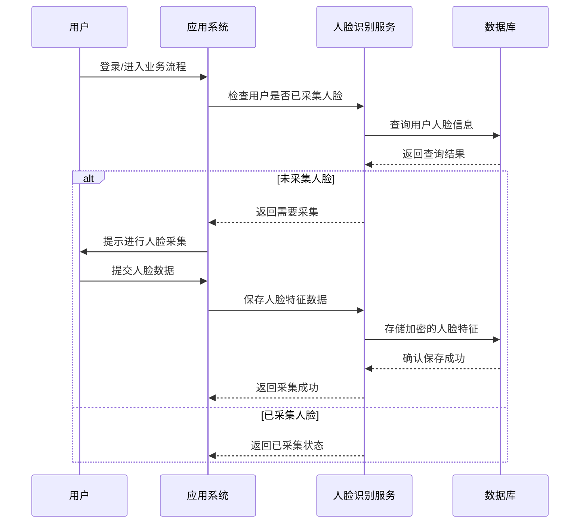
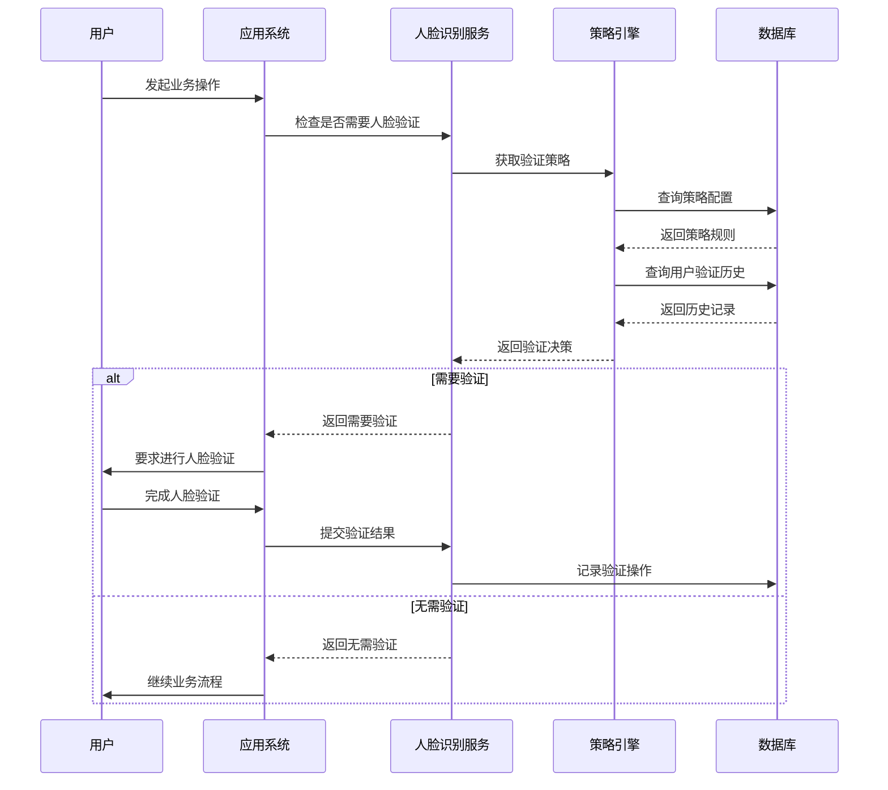
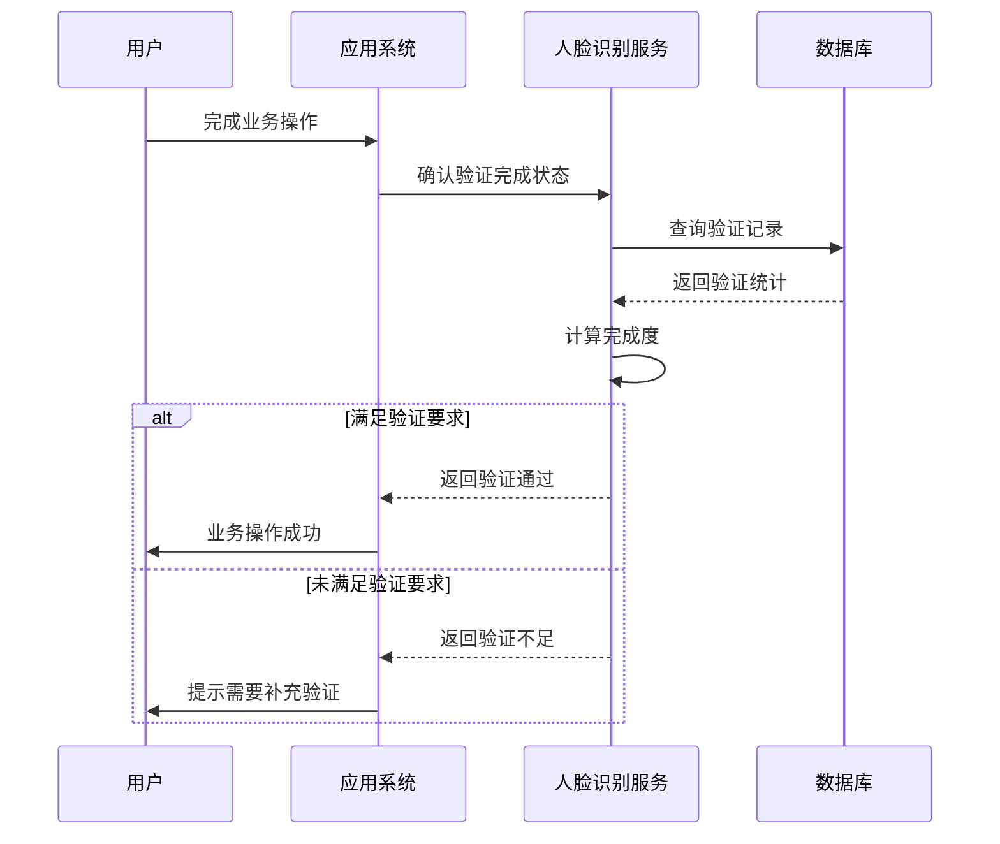
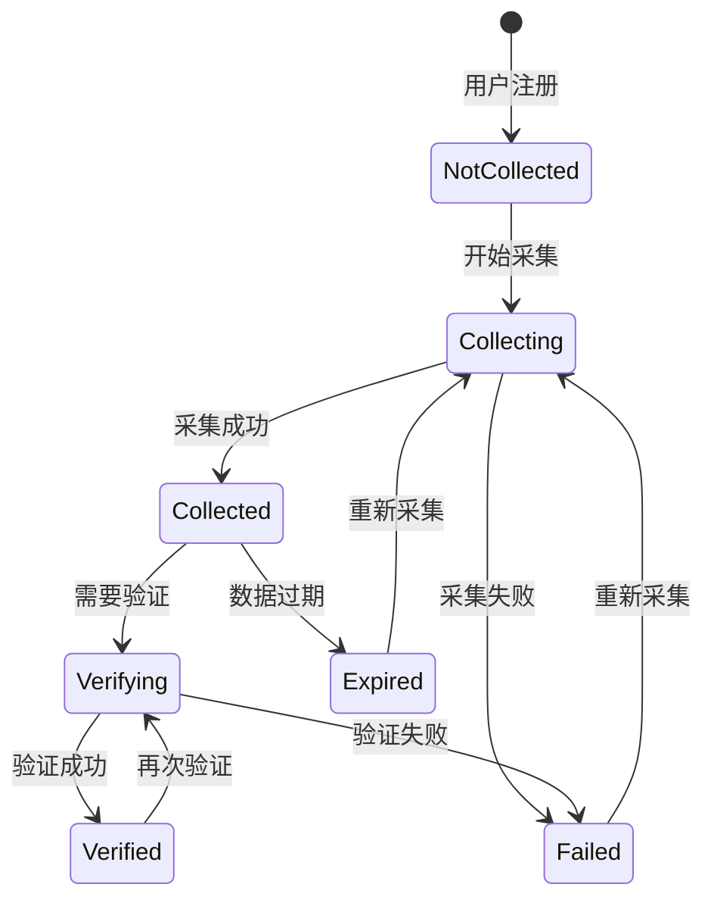

# 人脸识别业务流程分析

## 业务场景概述

### 场景1：人脸信息采集



### 场景2：验证需求判断



### 场景3：验证完成确认



## 核心业务规则

### 人脸采集规则

1. **首次采集**：用户首次使用时必须进行人脸采集
2. **重新采集**：人脸数据过期或质量不佳时需要重新采集
3. **采集频率**：同一用户24小时内最多采集3次
4. **数据保护**：人脸特征数据加密存储，不保存原始图像

### 验证策略规则

1. **时间策略**：
   - 距离上次验证超过N小时需要重新验证
   - 每日首次操作需要验证
   - 敏感时段（如深夜）强制验证

2. **频率策略**：
   - 连续操作超过N次需要验证
   - 高风险操作每次都需要验证
   - 批量操作需要验证

3. **风险策略**：
   - 异常IP地址访问需要验证
   - 设备指纹变化需要验证
   - 操作金额超过阈值需要验证

### 验证完成规则

1. **次数要求**：根据业务类型设定最低验证次数
2. **时效性**：验证记录有效期限制
3. **质量评估**：验证成功率达到阈值才算完成

## 数据模型设计

### 核心实体关系

```ascii
User (用户)
├── FaceProfile (人脸档案) [1:1]
├── VerificationRecord (验证记录) [1:N]
└── OperationLog (操作日志) [1:N]

VerificationStrategy (验证策略)
├── StrategyRule (策略规则) [1:N]
└── BusinessType (业务类型) [1:N]

VerificationRecord (验证记录)
├── User (用户) [N:1]
├── VerificationStrategy (验证策略) [N:1]
└── OperationLog (操作日志) [1:1]
```

### 状态流转图


